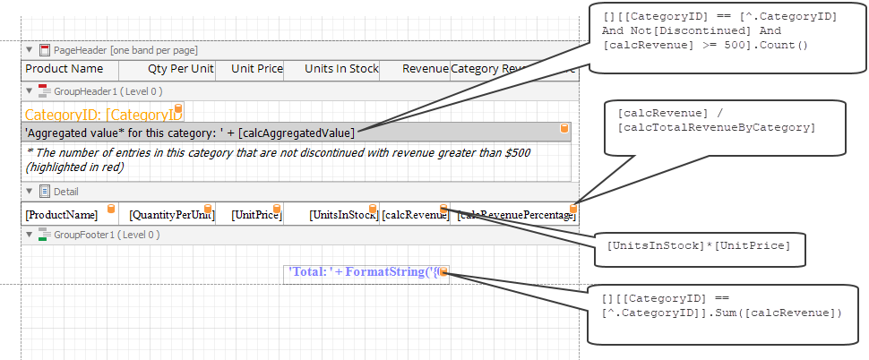

<!-- default badges list -->

<!-- default badges end -->
# Aggregate Functions in Calculated Fields - Usage Example

This example shows a report that uses aggregate functions in calculated fields. For each product, the report calculates the percentage of total revenue computed for all products that belong to a certain category. The report also counts the number of products in a category that are not discontinued and have revenue greater than $500.   

The aggregate expression has the following format:

`[<Collection>][<Condition>].<Aggregate>(<Expression>)`

- \<Collection\> - Specifies a collection for which an aggregated value is calculated. It can be the relationship name for a master-detail relationship, or a collection property name exposed by the target class. Empty brackets [] indicate the root collection.
- \<Condition\> - Specifies a condition that filters records for calculation. If the condition and its surrounding brackets are omitted, an aggregated value is calculated for all records (for example, [].Count()).
- \<Aggregate\> - Specifies an aggregate function.
- \<Expression\> - Specifies the expression being calculated. The expression contains field values (for example, [][[CategoryID] > 5].Sum([UnitPrice]*[Quantity])). Note that the Count function does not require arguments, and the expression is omitted in this case.
Use the Parent Relationship Traversal Operator ('^') to refer to the processed group (for example[][[^.CategoryID] == [CategoryID]].Sum([UnitPrice])). This operator allows you to calculate aggregates within groups.

Expressions used in this example are shown in the picture below: 

## Documentation

- [Use Calculated Fields](https://docs.devexpress.devx/XtraReports/4801/detailed-guide-to-devexpress-reporting/shape-report-data/use-calculated-fields)
- [Use Expressions](https://docs.devexpress.devx/XtraReports/120091/detailed-guide-to-devexpress-reporting/use-expressions)
- [Aggregate Enum](https://docs.devexpress.com/CoreLibraries/DevExpress.Data.Filtering.Aggregate)

## More Examples

- [How to create a calculated field at runtime](https://github.com/DevExpress-Examples/Reporting_how-to-create-a-calculated-field-at-runtime-e1489)
